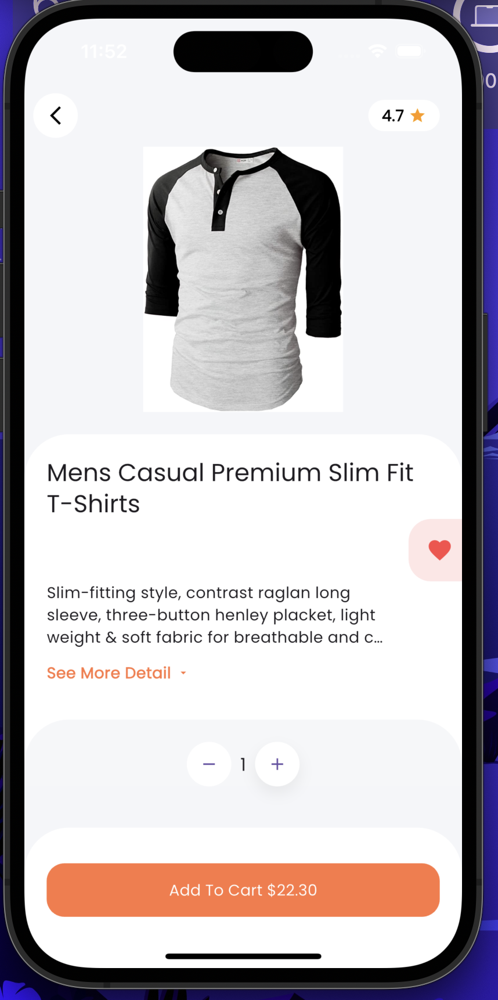

# A2SV Mobile Development Assessment

Welcome to the Flutter Developer Assessment! This task evaluates your ability to work with APIs, manage state, and implement core app functionality. You’ll have 2 hours to complete the tasks below.

## Task Overview

You’ll build a shopping cart app using the FakeStoreAPI. The test has three main components:
API Integration, Cart Functionality, UI/UX enhancements and add a new feature which is creating favorites section.

## The starter code includes:

```
ApiService (with the method to be implemented).

CartProvider (partially implemented).

Basic UI for product listing and cart.

Favorites Screen
```

## Setup Instructions

Fork the repository and clone it to your local machine.

Tasks

## Fix and Enhance ApiService

    The ApiService class has some issues. Your tasks are:

    Fix fetchProducts: Ensure it fetches and parses products correctly.

    Error Handling: Add proper error handling for network failures.

## Deliverables:

## A fully functional ApiService class.

    Handle json encoding and decoding.
    Proper error handling for the API calls.

## Implement Cart Functionality

The CartProvider class is partially implemented. Your tasks are:

### Add/Remove Items:

    Allow a user to add items to the cart.(This one is already implemented)

    Implement swipe-to-delete functionality for cart items.

### Quantity Adjustment:

    Add buttons to increase/decrease item quantities.

    Remove items if the quantity drops to zero.

### Total Price Calculations

    Display the total price of all items in the cart.

    Update the total price dynamically when items are added/removed.

### Checkout Flow:

    Add a "Checkout" button to simulate placing an order.

    Show a confirmation dialog before clearing the cart.

    Display a success message (e.g., "Order placed successfully!").

Deliverables:

    A fully functional cart with all features listed above.
    Clean and reusable code.

## Favorites Screen

    Add a new screen to the app that displays a list of favorite products for the user.

## Evaluation Criteria

Your submission will be assessed based on:

**Correctness** : Does the app work as expected?

**Code Quality**: Is the code clean, readable, and well-structured?

**Error Handling**: Are edge cases (e.g., network failures) handled gracefully?

**UI/UX** : Is the app intuitive and visually appealing?

**Testing**: Are the tests comprehensive

# Submission Guidelines

## Deliverables:

    Fork the repository and clone it to your local machine.
    Then send a pull request to the main repository.
    Attach screenshots for the three pages of the app.

## FAQ

```
Q: Can I use external libraries?
A: Yes

Q: What if the FakeStoreAPI is down?
A: Use mock data from the assets folder

Q: How do I handle navigation issues?
A: Use Navigator with MaterialPageRoute.

Q: Can I use generative AI for the assessment?
A: Yes
```

## Tips

### Focus on Core Features First:

    Fix ApiService and implement cart functionality.

    And add necessary UI for the cart_item widget.

## Test Edge Cases:

Empty cart, invalid quantities, network failures.

#### Ask Questions: If anything is unclear, don’t hesitate to ask!

## Good luck! 🚀

> > > > > > > bcb13432c476e93c5f8bc5095f17cfc38858a69f

# App ScreenShots

## Home Screen


## Home Screen with the cart and fav count


## Fav Screen


## Product Detail Screen



## Cart


## Order Confirmation


## Checkout(Success Screen)


